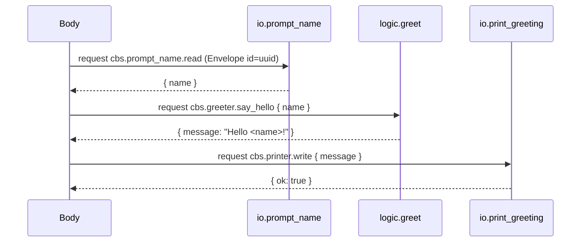

## CBS Data Flows (MVP)

### MVP Orchestration (Body-driven)



### Message Lifecycle
- **Create Envelope**: `id` (uuid v4), `service`, `verb`, `schema`, `payload`.
- **Subject**: `cbs.{service}.{verb}` (snake_case).
- **Request/Reply**: Use NATS request API; replies go to auto-inbox.
- **Queue Group**: `{service}` for load balancing across cell instances.

### Error Flow (contract)
Cells reply with error envelopes on failure:

```json
{ "id": "uuid", "error": { "code": "BadRequest", "message": "...", "details": {} } }
```

Clients treat any payload with `error` as failure. No mixed success + error.

### Distribution Model
- Cells may run in separate processes/hosts; NATS provides delivery and balancing.
- Body remains agnostic to co-location; contracts unchanged.

### Versioning
- `schema` is `domain/v{n}/Type` (e.g., `demo/v1/Name`).
- Only bump major `v{n}` on breaking payload changes. Support N-1 in adapters when feasible.

### Observability
- Propagate `Envelope.id` as correlation id.
- Emit spans for request start/end; tag with `service`, `verb`, `schema`.

### Flutter Web App Init (UI Loading Contract)
- The web `index.html` shows a cyan spinner until the Flutter app signals readiness.
- The spinner hides when the document `body` has class `flutter-loaded`.
- `applications/flutter_flow_web/lib/main.dart` adds `flutter-loaded` on web after the first frame, ensuring the overlay disappears and the `Flow` title renders.
- If you customize the loader, preserve this contract or adjust the hook accordingly.

### References
- See `ai/master_build_specs.md` §2 (Contracts), §7 (Testing), §11 (Extensibility).


